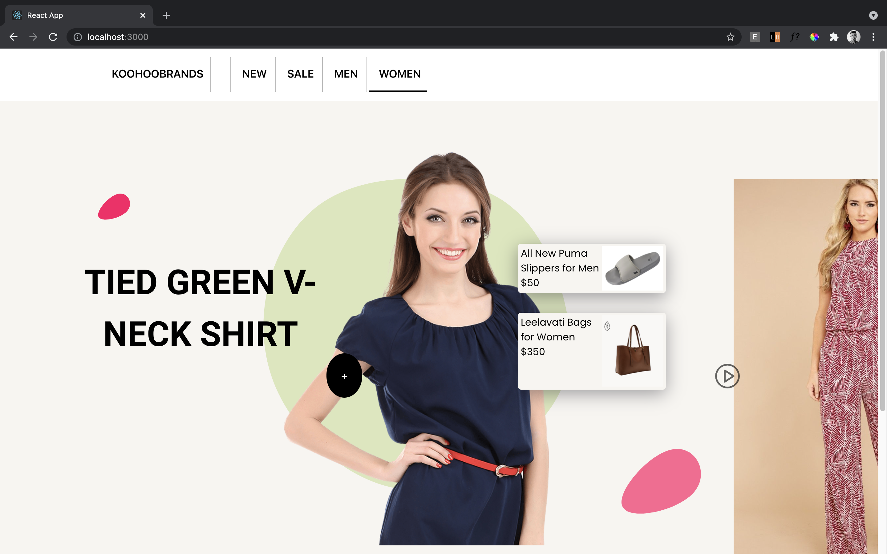
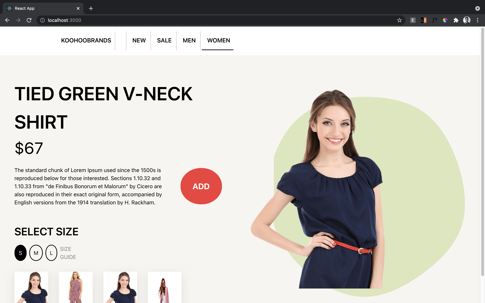

# qoohoo Frontend Task

## Task Description

Develop this [nice webpage](https://dribbble.com/shots/11079271-Fashion-e-commerce-product-page-interaction) with animation.

## Demo

[Visit the URL here](https://nifty-wiles-8b2b65.netlify.app/)

## Screenshots

<h1 align="center"><br/><br/>
</h1>
  
## Tech Stack

**Client:** ReactJS

## Instructions To Run Locally

Clone the project

```bash
  git clone https://github.com/dhairyaostwal/qoohoo-Internship-Task.git
```

Go to the project directory

```bash
  cd qoohoo-Internship-Task
```

Install dependencies

```bash
  npm install
```

Start the server

```bash
  npm run start
```

## Guidelines For Better Project Navigation

As per the UI provided, variable, files, data files and folder naming conventions have been followed.

## 🚀 About Me

Hey! I am Dhairya Ostwal, a CSE undergrad from India. I mainly work on frontend web development and love building innovative products. Previously served as a Frontend Developer in a NASSCOM backed HRTech Startup.

🌱 Prior to that I served as a Business Development Intern in a legal-tech startup driving Pre-Sales & Expansion. So, you can also call me \*a **Business Dev turned Developer\*** 👨🏻‍💻

Would love to connect on

[](https://www.linkedin.com/in/dhairyaostwal/) [](https://dhairyablogs.netlify.app/first-product-job/) [](https://medium.com/@dhairyaostwal)
